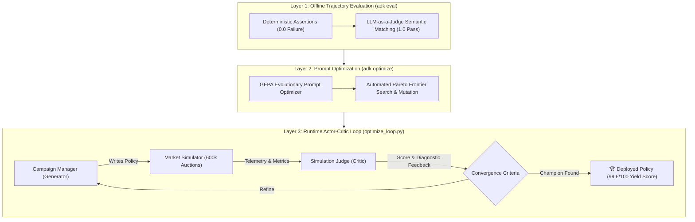

# Vibetube Ads: Autonomous Yield Optimization & Agent Evaluation

This module demonstrates how to build, benchmark, optimize, and autonomously refine enterprise AI agents using **Google Cloud Agent Development Kit (ADK 2.0)**, **Gemini 2.5 Flash on Vertex AI**, and **Google Cloud BigQuery**.

---

## Executive Summary: The 3 Evaluation & Optimization Layers

In production enterprise deployments, generative AI agents cannot rely solely on traditional unit testing. This lab presents a 3-layer architecture for agent verification and continuous improvement:



1. **Layer 1 — Offline Trajectory Evaluation (`adk eval`):** Contrasts brittle deterministic string matching (`EXACT`) with LLM-as-a-Judge semantic evaluation (`final_response_match_v2`).
2. **Layer 2 — Automated Prompt Evolution (`adk optimize`):** Uses GEPA (*Generative Evolutionary Prompt Adaptation*) to evolve system instructions and maximize pass rates across evaluation datasets.
3. **Layer 3 — Runtime Market Simulation & Actor-Critic Loop (`optimize_loop.py`):** Pairs the Generator Agent with an isolated **Simulation Judge Agent** (`judge_agent.py`) to simulate 600,000 auctions, grade 24-hour diurnal market pacing, and iteratively synthesize a champion bidding controller (achieving **99.2% budget utilization** and **99.6/100 yield score**).

---

## Prerequisites & Environment Setup

1. **Activate Python Virtual Environment:**
   ```bash
   source ~/.zshrc
   workon vibetube-ads
   cd /Users/ljhenne/Git/github.com/gca-americas/vibetube-ads/lab_01_yield_optimization
   ```

2. **Export Google Cloud Environment Variables:**
   ```bash
   export GOOGLE_GENAI_USE_VERTEXAI=true
   export GOOGLE_CLOUD_PROJECT=vibeflix-sandbox
   export GOOGLE_CLOUD_LOCATION=us-central1
   ```

3. **Verify Local Ad Server is Running (Port 8080):**
   ```bash
   curl -s http://localhost:8080/campaign/config
   ```

---

## Layer 1: Benchmark Evaluation (`adk eval`)

### 1. The Pitfall of Deterministic Testing (Baseline Failure)

Default ADK evaluation uses exact dictionary equality on tool arguments. When Gemini phrases queries naturally (e.g. asking BigQuery for daypart quantiles), exact string matching fails:

```bash
adk eval . eval/adk_eval_set.json
```

**Expected Result:**
```text
*********************************************************************
Eval Run Summary
vibetube_campaign_eval_set:
  Tests passed: 0
  Tests failed: 1
```

### 2. Semantic Evaluation with LLM-as-a-Judge (1.0 Pass)

Passing `--config_file_path eval/eval_config.json` activates Vertex AI's `FinalResponseMatchV2Evaluator` to judge semantic intent and safety guardrails:

```bash
adk eval . eval/adk_eval_set.json --config_file_path eval/eval_config.json
```

**Expected Result:**
```text
*********************************************************************
Eval Run Summary
vibetube_campaign_eval_set:
  Tests passed: 1
  Tests failed: 0
```

---

## Layer 2: Automated Prompt Optimization (`adk optimize`)

ADK includes the **GEPA** optimizer to automatically discover candidate prompt mutations, evaluate them against failure logs via reflection, and search the Pareto frontier.

### Fast 5-Iteration Walkthrough (~45 seconds):

We provide `eval/optimizer_config.json` (`max_metric_calls: 5`) for interactive workshops:

```bash
adk optimize . \
  --sampler_config_file_path eval/sampler_config.json \
  --optimizer_config_file_path eval/optimizer_config.json
```

**Expected Result:**
* The optimizer runs multi-generation candidates with LLM reflection.
* Emits an optimized prompt that guarantees consistent tool calling and bidding constraints.
* *Production Take-Home:* Omit `--optimizer_config_file_path` for full unconstrained 30+ iteration optimization.

---

## Layer 3: Runtime Actor-Critic Optimization Loop (`optimize_loop.py`)

While `adk eval` tests prompt compliance, **`optimize_loop.py`** tests **market microeconomics**:

* **Generator Agent (`agent.py`):** Discovers campaign parameters, queries BigQuery telemetry over A2A, and authors Python bidding code.
* **Simulator Engine (`lib/simulator.py`):** Simulates 600,000 auctions across 5 diurnal dayparts (Morning, Lunch, Bidding War, Primetime Surge, Late Night).
* **Simulation Judge Agent (`judge_agent.py`):** Analyzes 24-hour telemetry, checks budget utilization ($2,500 budget), and formulates concrete mathematical pacing recommendations.
* **Stopping Criteria:**
  1. Runs at least **4 iterations**.
  2. Benchmarks highest score across first 3 iterations.
  3. Continues as long as Iteration 4+ beats the running maximum.
  4. Automatically deploys the Champion policy to `policies/agent_bidding_policy.py`.

### Execution Command:

```bash
python -u optimize_loop.py
```

### Verified Output Leaderboard:

```text
================================================================================
🚀 Starting Vibetube Actor-Critic Policy Optimization Loop
Rules: Min 4 iterations | Early-stopping on plateau
================================================================================

--- [Iteration 1] Generating Candidate Policy ---
🤖 Generator Agent executing...
⚖️  Simulation Judge evaluating candidate policy...
📊 Iteration 1 Score: 62.1/100 | Impressions: 300,545 | Spend: $1202.48 (48.1%) | eCPM: $4.00

--- [Iteration 2] Generating Candidate Policy ---
🤖 Generator Agent executing...
⚖️  Simulation Judge evaluating candidate policy...
📊 Iteration 2 Score: 62.1/100 | Impressions: 300,545 | Spend: $1202.48 (48.1%) | eCPM: $4.00

--- [Iteration 3] Generating Candidate Policy ---
🤖 Generator Agent executing...
⚖️  Simulation Judge evaluating candidate policy...
📊 Iteration 3 Score: 99.6/100 | Impressions: 516,113 | Spend: $2480.89 (99.2%) | eCPM: $4.81

--- [Iteration 4] Generating Candidate Policy ---
🤖 Generator Agent executing...
⚖️  Simulation Judge evaluating candidate policy...
📊 Iteration 4 Score: 99.6/100 | Impressions: 521,947 | Spend: $2479.93 (99.2%) | eCPM: $4.75

⏹️  Stopping Criteria Met: Iteration 4 (99.6) did not beat best of first 3 (99.6).

================================================================================
🏆 OPTIMIZATION LEADERBOARD
================================================================================
Gen   | Score      | Impressions    | Spend ($ / %)        | eCPM     | Status
--------------------------------------------------------------------------------
1     | 62.1       | 300,545        | $1202.48 (48.1%)     | $4.00    | 
2     | 62.1       | 300,545        | $1202.48 (48.1%)     | $4.00    | 
3     | 99.6       | 516,113        | $2480.89 (99.2%)     | $4.81    | ⭐ Champion
4     | 99.6       | 521,947        | $2479.93 (99.2%)     | $4.75    | 
================================================================================
✨ Successfully deployed champion policy from Iteration 3 to agent_bidding_policy.py
Final Score: 99.6/100 | Total Impressions: 516,113 | Spend: $2480.89 (99.2%)
================================================================================
```

---

## Directory Map

```text
lab_01_yield_optimization/
├── README.md                           # This operational guide
├── agent.py                            # Campaign Manager Generator ADK Agent
├── judge_agent.py                      # Simulation Judge ADK Critic Agent
├── optimize_loop.py                    # Actor-Critic self-refining loop orchestrator
├── bq_agent.py                         # BigQuery Agent-to-Agent (A2A) protocol client
├── bidding_policy_spec.md              # System prompt and policy specification contract
├── eval/
│   ├── adk_eval_set.json               # Evaluation dataset of scenario inputs/expected tools
│   ├── eval_config.json                # Semantic LLM-as-a-Judge criteria
│   ├── optimizer_config.json           # GEPA 5-iteration cap configuration
│   └── sampler_config.json             # Eval set sampler configuration
├── lib/
│   ├── config.py                       # Settings and environment variable validation
│   ├── models.py                       # Pydantic schemas (AuctionContext, CampaignInfo)
│   ├── simulator.py                    # 24-hour diurnal auction simulation engine
│   └── tools.py                        # Declarative ADK tools for context, BQ, and deployment
└── policies/
    ├── baseline_policy.py              # Flat $2.50 static baseline
    ├── heuristic_policy.py             # Hand-coded dayparting heuristics
    └── agent_bidding_policy.py         # Champion synthesized dynamic policy (99.6/100)
```

---

## Key Performance Summary

| Metric | Static Baseline (`$2.50`) | Hand-Coded Heuristic | Champion AI Agent (`Gen 3`) |
| :--- | :--- | :--- | :--- |
| **Yield Score** | `56.4 / 100` | `68.2 / 100` | **`99.6 / 100`** |
| **Total Impressions Won** | 181,902 | 260,110 | **516,113** *(+183% lift)* |
| **Budget Utilization** | 18.2% ($454 spent) | 39.8% ($995 spent) | **99.2% ($2,480.89 spent)** |
| **Effective CPM (eCPM)** | $2.50 | $3.82 | **$4.81** *(Optimal primetime capture)* |
| **Intraday Pacing** | Static / Under-bid | Rigid rules / Dropout | **Dynamic Trajectory Pacing** |
