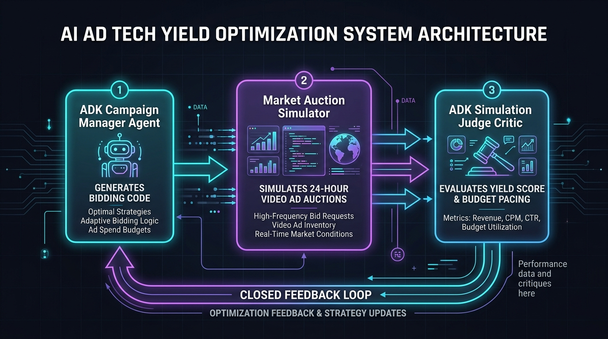

# Vibetube Ads: Autonomous Yield Optimization & Agent Evaluation

This folder contains the **Autonomous Yield Optimization & Policy Evaluation** engine for Vibetube Ads. It demonstrates how to develop, test, optimize, and autonomously iterate programmatic bidding agents using the **Google Cloud Agent Development Kit (ADK)** and **Gemini 2.5 on Vertex AI**.



---

## Quickstart & Environment Setup

```bash
# 1. Activate environment
source ~/.zshrc
workon vibetube-ads
cd /Users/ljhenne/Git/github.com/gca-americas/vibetube-ads/lab_01_yield_optimization

# 2. Configure Google Cloud & Vertex AI credentials
export GOOGLE_GENAI_USE_VERTEXAI=true
export GOOGLE_CLOUD_PROJECT=vibeflix-sandbox
export GOOGLE_CLOUD_LOCATION=us-central1
```

---

## How to Run the Policies & Agents

### 1. Run the Campaign Manager Agent (`agent.py`)
Executes the ADK agent to inspect campaign settings, query BigQuery historical telemetry, and synthesize a dynamic bidding policy script:

```bash
python agent.py
```

### 2. Benchmark Bidding Policies in the Market Simulator
Simulates 24 hours (600,000 auctions) of diurnal ad traffic across baseline, heuristic, and AI-generated policies:

```bash
python -c "
from pathlib import Path
from lib.simulator import load_policy_from_code, run_simulation

for policy_name in ['baseline_policy.py', 'heuristic_policy.py', 'agent_bidding_policy.py']:
    path = Path('policies') / policy_name
    if path.exists():
        func = load_policy_from_code(path.read_text())
        result = run_simulation(func)
        print(f'{policy_name:25} -> {result.summary_text}')
"
```

### 3. Run Semantic Agent Evaluation (`adk eval`)
Evaluates the agent's reasoning trajectory and tool usage against the test suite using LLM-as-a-Judge semantic matching:

```bash
adk eval . eval/adk_eval_set.json --config_file_path eval/eval_config.json
```

### 4. Run Automated Prompt Optimization (`adk optimize`)
Uses the GEPA evolutionary optimizer with reflection to automatically refine the agent's prompt instructions:

```bash
adk optimize . \
  --sampler_config_file_path eval/sampler_config.json \
  --optimizer_config_file_path eval/optimizer_config.json
```

### 5. Run the Actor-Critic Self-Refining Loop (`optimize_loop.py`)
Pairs the **Campaign Manager** (Generator) with the **Simulation Judge** (Critic) to iteratively simulate, critique, and evolve a champion bidding controller:

```bash
python -u optimize_loop.py
```
* **Early Stopping:** Runs at least 4 iterations, compares against the initial 3-generation benchmark, stops on score plateau, and deploys the champion algorithm to `policies/agent_bidding_policy.py`.

---

## Folder Structure

```text
lab_01_yield_optimization/
├── README.md                  # This guide
├── architecture.jpg           # Architecture infographic
├── agent.py                   # Campaign Manager Generator ADK Agent
├── judge_agent.py             # Simulation Judge Critic ADK Agent
├── optimize_loop.py           # Actor-Critic feedback loop orchestrator
├── bq_agent.py                # BigQuery Agent-to-Agent (A2A) client
├── bidding_policy_spec.md     # Agent system prompt & API contract
├── eval/                      # ADK evaluation datasets and configs
│   ├── adk_eval_set.json      # Test scenarios and expected tool calls
│   ├── eval_config.json       # LLM-as-a-Judge semantic matching config
│   ├── optimizer_config.json  # GEPA optimizer hyperparameters
│   └── sampler_config.json    # Eval sampler configuration
├── lib/                       # Core simulation & model libraries
│   ├── config.py              # Environment configuration
│   ├── models.py              # Pydantic schemas (AuctionContext, CampaignInfo)
│   ├── simulator.py           # 24-hour diurnal market simulation engine
│   └── tools.py               # Declarative ADK tools for context & deployment
└── policies/                  # Synthesized & baseline bidding policies
    ├── baseline_policy.py     # Flat $2.50 static baseline
    ├── heuristic_policy.py    # Hand-crafted dayparting rules
    └── agent_bidding_policy.py# Synthesized dynamic champion policy (99.6/100 score)
```
